# Homework 2

Here is one solution for [Homework 2 of SWE 3643 (Fall 2024)](https://github.com/jeff-adkisson/swe-3643-fall-2024/blob/main/homework/homework-2.md). The assignment focuses on analyzing and testing a moderately complex algorithm, with the following key objectives:

1. Branch Analysis: Converted a pseudocode algorithm into a graph for comprehensive testing.
2. Code Implementation: Translated the pseudocode into executable code.
3. Unit Testing: Wrote unit tests to ensure 100% coverage, using various assertions.
4. Coverage Analysis: Conducted coverage testing to ensure all branches are thoroughly tested. 
5. Standard Deviation Interpretation: Added method and parameterized tests.

Please refer to the README for detailed instructions and implementation.

## 1. Branch Analysis 

Following is a graph of the Standard Deviation Calculation from
the [Homework 2 pseudocode](https://github.com/jeff-adkisson/swe-3643-fall-2024/blob/main/homework/homework-2.md#standard-deviation-calculator-pseudocode). The graph was made with [Mermaid.js](https://mermaid.js.org/syntax/flowchart.html)

```mermaid
---

title: Standard Deviation Functions
---
flowchart TD
    startSample(((START Sample Std Dev))) --> |Client PASSES $valuesArr|computeSampleStdDev
    computeSampleStdDev[ENTRY FUNC: Compute Sample Std Dev]
    computeSampleStdDev --> |PASS $valuesArr, $isPopulation=false|computeStdDev
    
    startPop(((START Population Std Dev))) --> |Client PASSES $valuesArr|computePopStdDev
    computePopStdDev[ENTRY FUNC: Compute Pop Std Dev]
    computePopStdDev --> |PASS $valuesArr, $isPopulation=true|computeStdDev

    stdDevValid{Is Array Empty?}
    computeStdDev --> stdDevValid
    stdDevValid --> |Empty| stdDevError[[ERROR - $valuesArr cannot be empty]]
    stdDevValid --> |PASS $valuesArr| computeMean

    computeStdDev[FUNC Compute Standard Deviation]

    computeMean[FUNC Compute Mean of Values]
    computeMeanValid{Is Array Empty?}
    computeMean --> computeMeanValid
    computeMeanValid --> |Empty| computeMeanError[[ERROR - $valuesArr cannot be empty]]
    computeMeanValid --> |Not Empty| meanLoop[Accumulate Sum of Values]
    meanLoop{LOOP All Values Processed?}
    meanLoop --> |No, Values Remain|meanAccumulator[Accumulate Sum of Values]
    meanAccumulator --> |Next Value|meanLoop
    meanLoop --> computeMeanAssign[ASSIGN $mean = sum / array length]

    computeMeanReturn((RETURN $mean))
    computeMeanAssign --> |End of FUNC Compute Mean of Values| computeMeanReturn
 
    computeMeanReturn --> |PASS $valuesArr, $mean|computeSquareDiff
    computeSquareDiff[FUNC Compute Square of Differences]
    computeSquareDiffValid{Is Array Empty?}
    computeSquareDiff-->computeSquareDiffValid
    computeSquareDiffValid --> |Empty| computeSquareDiffError[[ERROR - $valuesArr cannot be empty]]
    computeSquareDiffValid --> |Not Empty| squareDiffLoop[Accumulate Sum of Square of Difference]
    squareDiffLoop{LOOP All Values Processed?}
    squareDiffLoop --> |No, Values Remain|squareDiffAccumulator[ASSIGN $squareOfDiff += Square of Difference of Value from Mean]
    squareDiffAccumulator --> |Next Value|squareDiffLoop
    squareDiffLoop --> |End of FUNC Compute Square of Differences| squareDiffLoopReturn
    squareDiffLoopReturn((RETURN $squareOfDiff))
    squareDiffLoopReturn --> |PASS $squareOfDiff, $numValues=valuesArr.length, $isPopulation| computeVariance

    computeVariance[FUNC Compute Variance] --> computeVarianceLength
    computeVarianceLength{ Is Sample / NOT Population? }
    computeVarianceLength --> |Is Sample|computeVarianceLengthSample
    computeVarianceLength --> | Is Population| computeVarianceValid
    computeVarianceLengthSample[ASSIGN $numValues=$numValues-1]
    computeVarianceValid{Is $numValues < 0}
    computeVarianceLengthSample --> computeVarianceValid
    computeVarianceError[[ERROR - $numValues must be at least 1]]
    computeVarianceValid --> | $numValues < 1| computeVarianceError
    computeVarianceValid --> |$numValues >= 1|computeVarianceCalc
    computeVarianceCalc[ASSIGN $variance=$squareOfDiff/$numValues] --> |End of FUNC Compute Variance| computeVarianceReturn
    computeVarianceReturn((RETURN $variance)) --> computeSqrRoot

    computeSqrRoot[ASSIGN $stdDev=Square Root of $variance]

    computeSqrRoot --> |End of FUNC Compute Standard Deviation| computeSqrRootReturn
    computeSqrRootReturn((RETURN $stdDev)) --> |End of ENTRY FUNC| computeSqrRootReturnToEntry
    computeSqrRootReturnToEntry((RETURN $stdDev))
    computeSqrRootReturnToEntry --> |Client receives $stdDev|finish
    finish(((END)))
```

## 2. Code Implementation

Converted pseudocode to C# code in two projects: Calculator and Console.

To execute the code from a Terminal:
1. Clone the repository.
2. Navigate to the Homework2.Console project directory.
3. Run the following command: `dotnet run`

#### Example Output
```bash
➜  Homework2 git:(main) ✗ cd Homework2.Console 
➜  Homework2.Console git:(main) ✗ dotnet run
Sample StdDev = 1.5811388300841898
Population StdDev = 2.9832867780352594
```

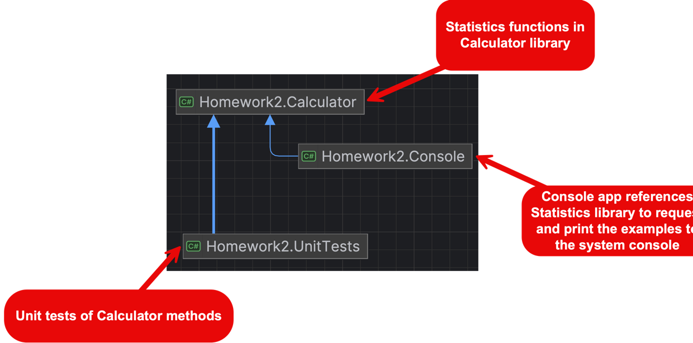

## 3. Unit Testing

Implemented unit tests for the Calculator project using nUnit. 

The tests cover all branches of the Standard Deviation calculation functions.

All tests use the naming convention: `MethodName_StateUnderTest_ExpectedBehavior` and
follow the AAA (Arrange, Act, Assert) pattern.

To execute the unit tests from a Terminal:
1. Clone the repository.
2. Navigate to the Homework2.UnitTests project directory.
3. Run the following command: `dotnet test`

#### Example Output
```bash
➜  Homework2 git:(main) ✗ cd Homework2.UnitTests 
➜  Homework2.UnitTests git:(main) ✗ dotnet test
  Determining projects to restore...
  All projects are up-to-date for restore.
Test run for Homework2.UnitTests/UnitTests.dll (.NETCoreApp,Version=v8.0)

Starting test execution, please wait...
A total of 1 test files matched the specified pattern.

Passed!  - Failed:     0, Passed:    10, Skipped:     0, Total:    10, Duration: 12 ms

```

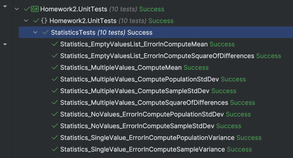

## 4. Coverage Analysis

My initial unit tests did not achieve 100% coverage. The
standard deviation calculation uses a variety of functions to produce a value.
Each of these functions in the pseudocode checks for empty arrays. If function A
checks for an empty array, function B does not need to check for an empty
array. This is because function B is only called if function A completes. Therefore,
the error check in B was not achieving coverage.

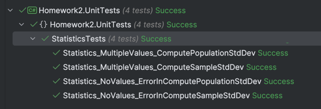

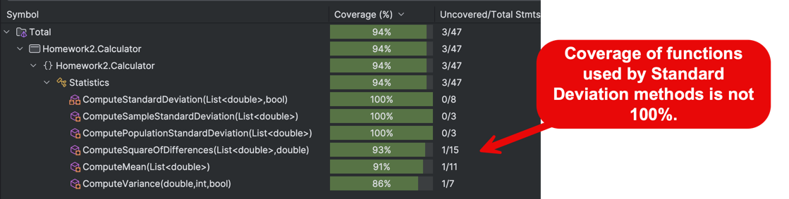

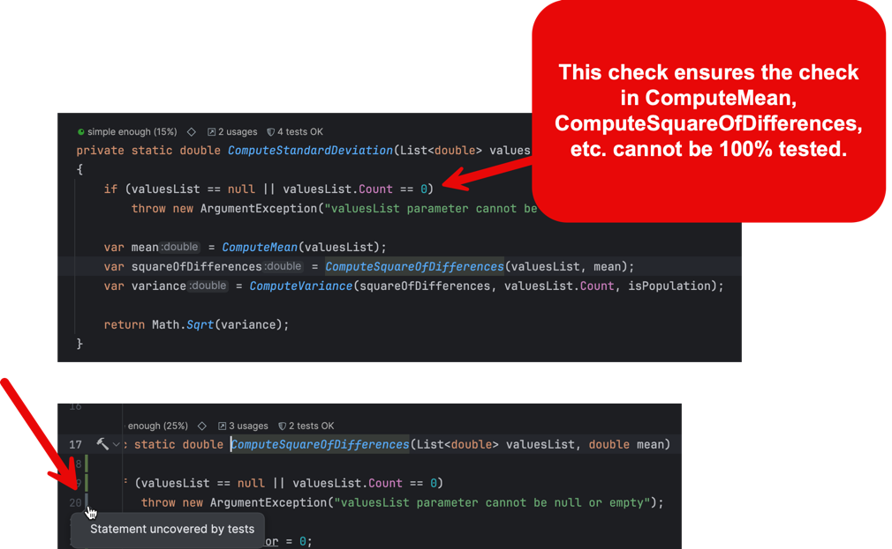

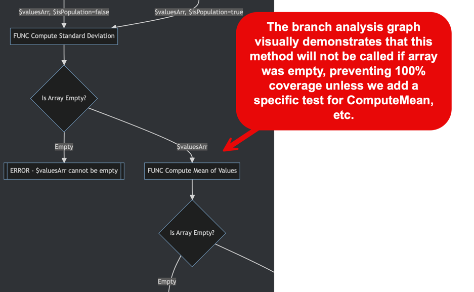

Adding additional tests that directly called ComputeMean, etc., for their 
error checks achieved 100% coverage of all code in the Statistics library.

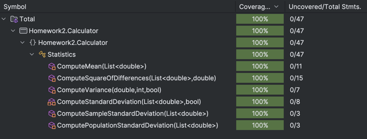

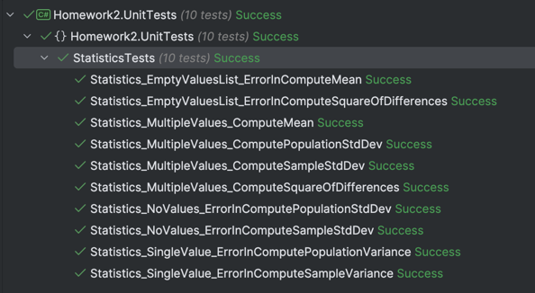

## 5. Standard Deviation Interpretation

1. Added a method to the Interpretation class to describe the standard deviation value.
2. Added parameterized tests to test the Interpretation method with various standard deviation values.
3. Achieved 100% test coverage for the Interpretation class.

#### Example Output (added to Console project)
```bash
➜  Homework2.Console git:(main) ✗ dotnet run
Sample StdDev = 1.5811388300841898 (Near Average)
Population StdDev = 2.9832867780352594 (Above Average)
```

#### Parameterized Tests
```c#
[TestCase(3.0, "Above Average")]
[TestCase(-3.0, "Below Average")]
[TestCase(0.0, "Exactly Average")]
[TestCase(1.5, "Near Average")]
[TestCase(-1.5, "Near Average")]
[TestCase(2.0, "Near Average")]
[TestCase(-2.0, "Near Average")]
public void Interpretation_StandardDeviation_ReturnsInterpretationOfStandardDeviation(double input, string expectedOutput)
{
    var result = Interpretation.InterpretStandardDeviation(input);
    Assert.That(result, Is.EqualTo(expectedOutput));
}
```

#### Test Execution
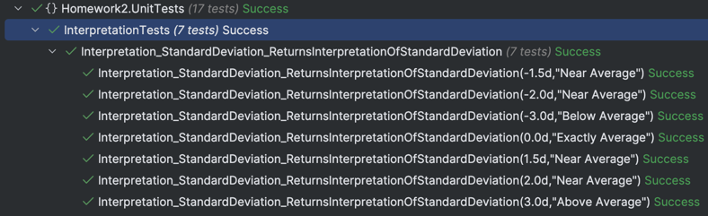

#### Coverage Analysis
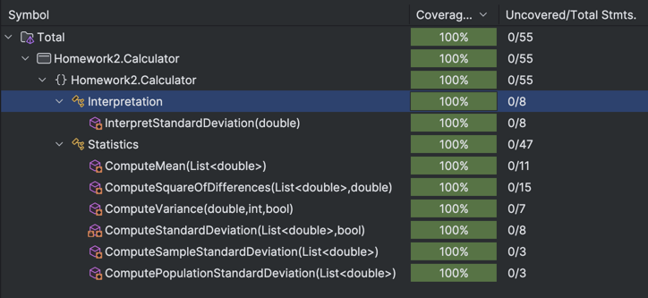


