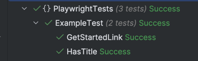
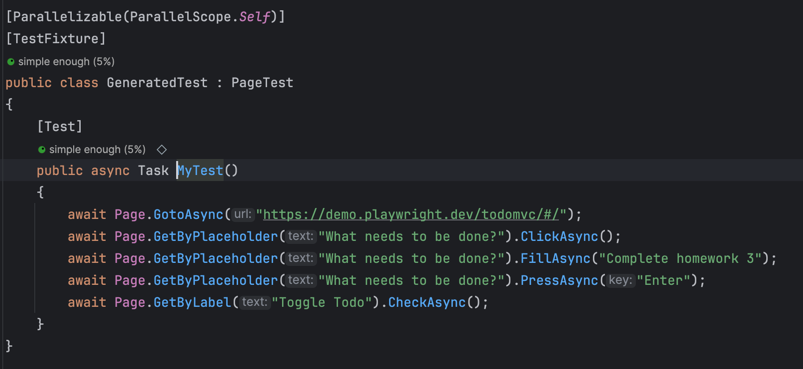
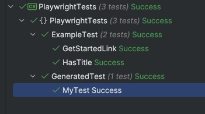
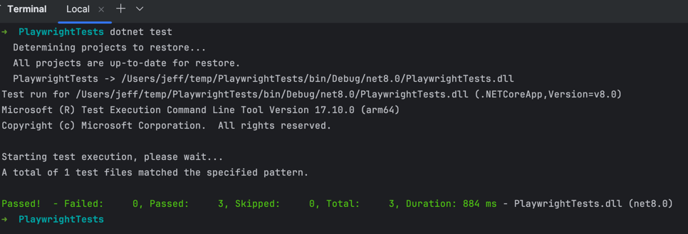

# Homework 3

## To Prepare Environment

1. Install Powershell.
2. Open a terminal and navigate to the `PlaywrightTests` directory.
3. Run `dotnet build` to build the project.
4. Run `pwsh bin/Debug/net8.0/playwright.ps1 install` to install the headless browser.

## To Execute

1. Clone repo.
2. Open a terminal and navigate to the `PlaywrightTests` directory.
3. Run `dotnet test`.

## Steps Completed
1. Configured Playwright.
2. Verified Operation with a Sample Playwright Test 
   { 
   
3. Wrote an E2E Test using the Playwright Test Generator 
    
   
4. Executed Tests from Command Line / Terminal 
   